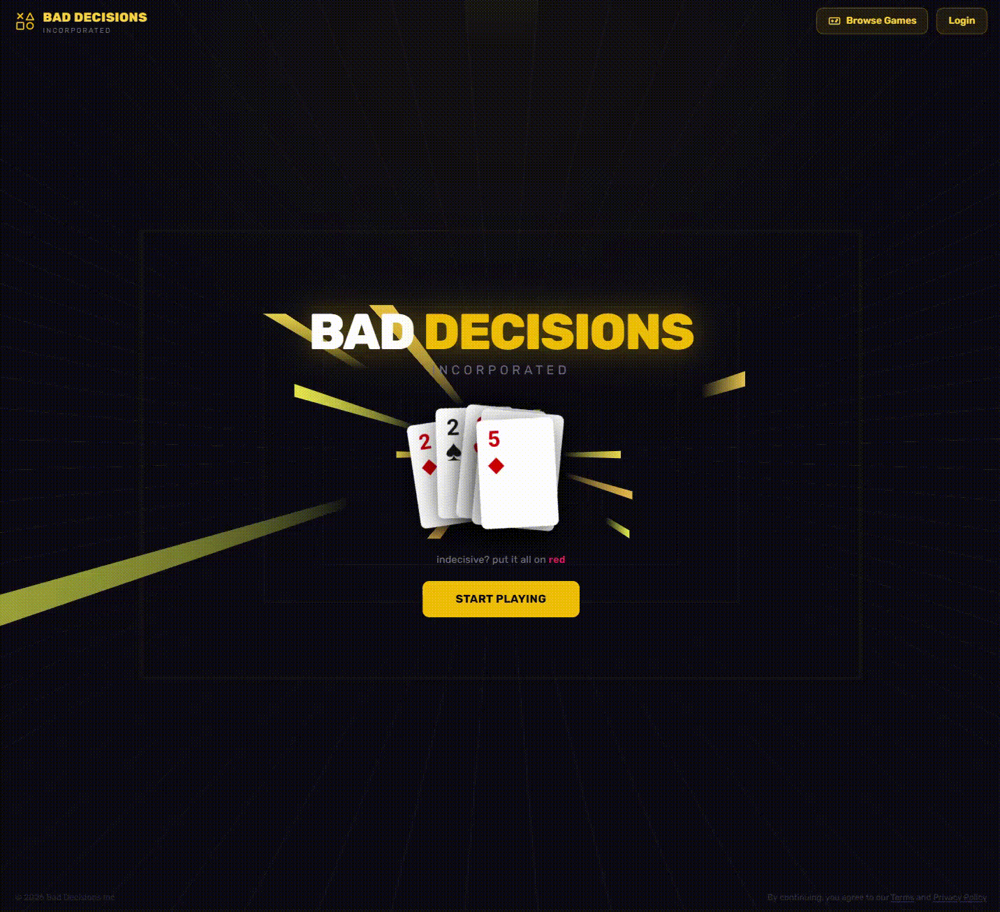

## Demo

<p align="center">
  <a href="Rebel_Hacks_Draft_Demo.gif">
    
  </a>
</p>

## Inspiration

Every friend group in Vegas asks the same questions: "Where should we eat?" "What should we do next?" Nobody wants to decide, everyone has an opinion, and you burn half the night arguing. Vegas is a city built on settling things with a gamble -- so we thought, why not settle group decisions the same way? Instead of doom-scrolling Yelp or doing the painful "I don't care, you pick" dance, we built a platform where you literally wager your say on fast, chaotic mini-games.

Winner picks the spot. Loser takes the punishment card. Just like Vegas: the house always deals, and somebody always walks away with a story.

## What it does

Bad Decisions Inc is a real-time, mobile-first party mini-game platform designed for groups on the go. One person hosts a room and everyone else joins instantly by scanning a QR code -- no app downloads, no sign-ups for players. The host picks from five Vegas-themed mini-games:

Rebel Shake -- a 15-second phone-shaking frenzy (like shaking dice at the craps table)
Vegas Pan Flip -- flick your phone to launch and flip an egg (high-stakes flipping)
Poker Chip Tap -- spam-tap a 3D poker chip for the highest score before time runs out
Kanpai Timing -- tap in rhythm as two beer glasses clink to a beat (precision under pressure)
Chopstick Catch -- catch falling sushi with chopsticks in a 3D scene (dexterity challenge)

Every round has a synced countdown, live race-track leaderboard, and real-time scoring. The winner earns the right to call the next move for the group. It's how Vegas would solve your group's indecision.

## How we built it

- Turborepo monorepo with a Next.js web app and shared backend package
- Convex for the real-time backend -- rooms, players, join requests, and live score syncing all happen through Convex mutations/queries with zero polling
- Clerk for host authentication (players join as guests via QR code, no auth friction)
- React Three Fiber + Three.js for 3D game scenes (beer glasses clinking in Kanpai, poker chip spinning in Tap, chopsticks + falling sushi in Chopstick Catch, pan/egg physics in Flip)

-- Fully mobile-first responsive design with a dark/gold Vegas casino aesthetic

## Challenges we ran into

Real-time sync across devices was the hardest problem. Every player needs to see the same countdown and game timer despite network latency and clock drift. We built a custom useSyncedRound hook that anchors everything to server-side timestamps rather than local clocks.

QR code join flow -- making the guest join experience feel instant (scan -> name -> play) while still giving the host approval control over who enters the room.

## Accomplishments that we're proud of

Zero-install player experience -- scan a QR code, type your name, and you're in. No app store, no sign-up. This was a deliberate design choice to match the spontaneous energy of a Vegas night out.
The race-track leaderboard -- watching avatars slide across the track in real-time as scores update is genuinely fun to spectate, especially on the host's screen projected for the group.

The 3D interactions feel physical -- shaking your phone, flicking to flip, tapping a poker chip, catching sushi with chopsticks. Every game uses the phone as a physical controller, not just a screen.

## What we learned

Real-time multiplayer is a fundamentally different paradigm from request/response. Convex's reactive queries made it viable at hackathon speed, but thinking in terms of "what does every client see right now" instead of "what did the server respond" type sh.

Mobile browser APIs (DeviceMotion, touch events, WebGL) are powerful but inconsistent. Testing on real devices early and often saved us from discovering permission and performance issues at demo time.
Keeping the join flow frictionless matters more than adding features. Every extra tap between "scan QR" and "playing the game" is a player you lose.

## What's next for Bad Decisions Inc.

Punishment cards & reward system -- the winner doesn't just pick the spot; losers draw from a deck of Vegas-style dares and challenges. Think: "Loser has to order in a terrible accent" or "Loser pays for the appetizer."

Vegas venue integration -- tie game outcomes to actual Vegas restaurant/bar recommendations so the winner's choice is surfaced automatically ("You won -- here are 3 spots nearby, pick one").
Tournament mode -- chain multiple mini-games into a best-of series with cumulative scoring, so one night out becomes a full Vegas bracket.

More mini-games -- slot machine reaction time, roulette spin prediction, blackjack-style number games. The Vegas theme is an endless well of game mechanics.

Native mobile app (the Expo app in the monorepo) for push notifications, haptics, and smoother device motion access.

RHYTHM GAMESSSSSSSSSSSSSS.

---

# Development

## 1. Install dependencies

Run `yarn`.

## 2. Configure Convex

```sh
npm run setup --workspace packages/backend
pnpm install
```

The script will log you into Convex if you aren't already and prompt you to
create a project (free). It will then wait to deploy your code until you set the
environment variables in the dashboard.

Configure Clerk with [this guide](https://docs.convex.dev/auth/clerk). Then add
the `CLERK_ISSUER_URL` found in the "convex" template
[here](https://dashboard.clerk.com/last-active?path=jwt-templates), to your
Convex environment variables
[here](https://dashboard.convex.dev/deployment/settings/environment-variables&var=CLERK_ISSUER_URL).

Make sure to enable **Google and Apple** as possible Social Connection
providers, as these are used by the React Native login implementation.

After that, optionally add the `OPENAI_API_KEY` env var from
[OpenAI](https://platform.openai.com/account/api-keys) to your Convex
environment variables to get AI summaries.

The `setup` command should now finish successfully.

### 3. Configure both apps

In each app directory (`apps/web`, `apps/native`) create a `.env.local` file
using the `.example.env` as a template and fill out your Convex and Clerk
environment variables.

- Use the `CONVEX_URL` from `packages/backend/.env.local` for
  `{NEXT,EXPO}_PUBLIC_CONVEX_URL`.
- The Clerk publishable & secret keys can be found
  [here](https://dashboard.clerk.com/last-active?path=api-keys).

### 4. Run both apps

Run the following command to run both the web and mobile apps:

```sh
npm run dev
pnpm dev
```

This will allow you to use the ⬆ and ⬇ keyboard keys to see logs for each
of the Convex backend, web app, and mobile app separately.
If you'd rather see all of the logs in one place, delete the
`"ui": "tui",` line in [turbo.json](./turbo.json).

## Deploying

In order to both deploy the frontend and Convex, run this as the build command from the apps/web directory:

```sh
cd ../../packages/backend && npx convex deploy --cmd 'cd ../../apps/web && turbo run build' --cmd-url-env-var-name NEXT_PUBLIC_CONVEX_URL

```

There is a vercel.json file in the apps/web directory with this configuration for Vercel.

To install a new package, `cd` into that directory, such as [packages/backend](./packages/backend/), and then run `yarn add mypackage@latest`

# Extra Questions

Step 5 of devpost submission.

## How does your project solve your proposed problem?

A lot of people waste time arguing over where to go. Bad Decisions Inc offer a solution by playing a 15-second mini-game -- winner picks the spot. Scan a QR code, play, and move on with your night.

## How does your project work in-depth?

Host logs in via Clerk, creates a room on Convex. Players scan a QR code to join -- no signup. Convex streams real-time scores with zero polling. Server-anchored timestamps sync countdowns across devices. 3D scenes render via React Three Fiber

## What makes your project unique?

It uses da phone as a physical game controller -- shake it, flick it, tap it. Five 3D mini-games, all in-browser with zero installs. A table of strangers can be playing within 10 seconds of scanning one QR code

## How effective does your project work as advertised?

All mini-games work end-to-end: host creates room, players join via QR, synced countdown fires, scores update live on a race-track leaderboard, winner is announced. Tested on iOS Safari and Android Chrome.

## How does your project relate to the theme?

Vegas is where you settle everything with a gamble. -- our app does the same for group decisions. Casino-coded games (poker chips, dice shaking), gold-and-black aesthetic, and a core loop of play, win, pick the spot.
